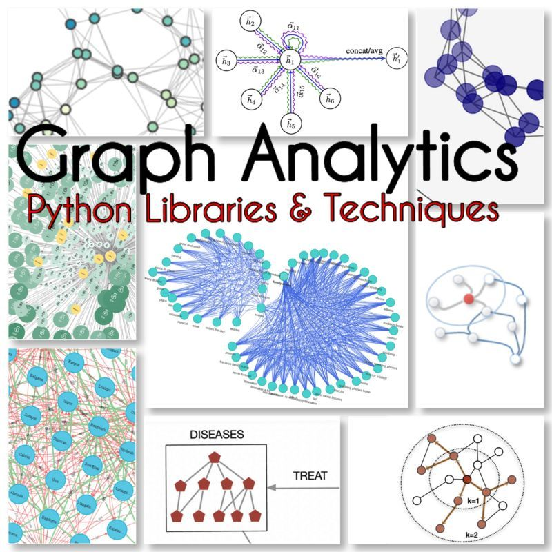
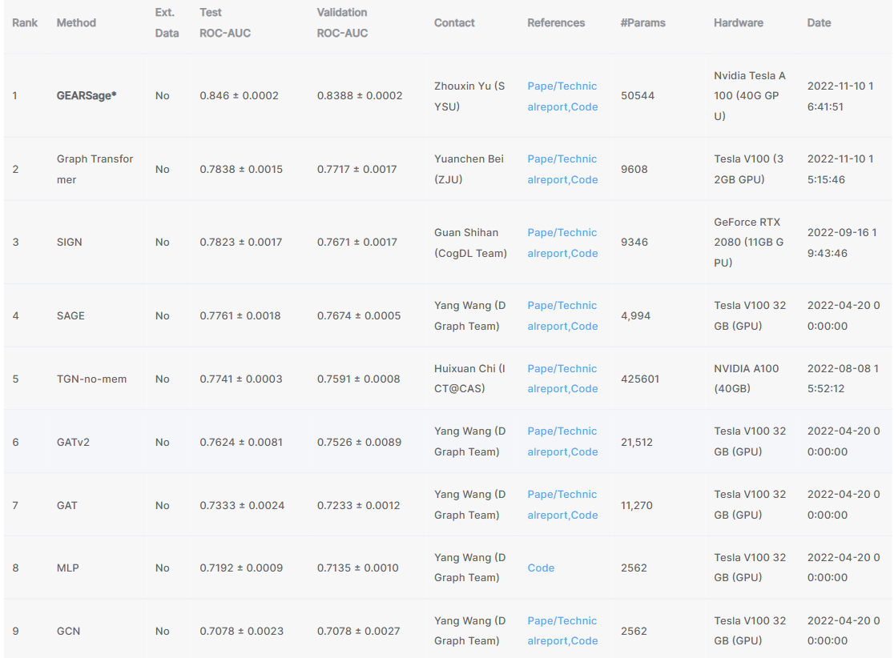

# Graph_Neural_Network

𝐔𝐧𝐥𝐞𝐚𝐬𝐡𝐢𝐧𝐠 𝐭𝐡𝐞 𝐏𝐨𝐰𝐞𝐫 𝐨𝐟 𝐆𝐫𝐚𝐩𝐡 𝐀𝐧𝐚𝐥𝐲𝐭𝐢𝐜𝐬: 𝟐𝟓 𝐓𝐨𝐩 𝐏𝐲𝐭𝐡𝐨𝐧 𝐋𝐢𝐛𝐫𝐚𝐫𝐢𝐞𝐬, 𝐀𝐥𝐠𝐨𝐫𝐢𝐭𝐡𝐦𝐬, 𝐓𝐲𝐩𝐞𝐬 𝐚𝐧𝐝 𝐓𝐞𝐜𝐡𝐧𝐢𝐪𝐮𝐞𝐬

Graph Analytics extracts valuable insights from complex, interconnected data with ability to represent relationships between entities.

𝔾𝕣𝕒𝕡𝕙 ℂ𝕠𝕞𝕡𝕠𝕤𝕚𝕥𝕚𝕠𝕟:

- Nodes: represent entities
- Edges: link between entities

𝔾𝕠𝕒𝕝𝕤 𝕠𝕗 𝔾𝕣𝕒𝕡𝕙 𝔸𝕟𝕒𝕝𝕪𝕥𝕚𝕔𝕤:

*͠ Identify key entities and their relationships
*͠ Discover patterns and anomalies in large-scale datasets
*͠ Generate recommendations and predictions based on past behavior
*͠ Uncover community structures within networks
*͠ Predict missing links and uncover hidden connections

𝕋𝕪𝕡𝕖𝕤 𝕠𝕗 𝔾𝕣𝕒𝕡𝕙 𝔸𝕟𝕒𝕝𝕪𝕥𝕚𝕔𝕤:

𝐆𝐫𝐚𝐩𝐡 𝐍𝐞𝐮𝐫𝐚𝐥 𝐍𝐞𝐭𝐰𝐨𝐫𝐤𝐬 (𝐆𝐍𝐍): A class of deep learning models that operate directly on graph structures.

Examples of GNNs include:
Ⓞ Graph Convolutional Networks (GCN)
Ⓞ Graph Attention Networks (GAT)
Ⓞ GraphSAGE

𝐅𝐞𝐚𝐭𝐮𝐫𝐞𝐬 𝐄𝐱𝐭𝐫𝐚𝐜𝐭𝐢𝐨𝐧 𝐰𝐢𝐭𝐡 𝐂𝐞𝐧𝐭𝐫𝐚𝐥𝐢𝐭𝐲 𝐌𝐞𝐚𝐬𝐮𝐫𝐞𝐬: Centrality measures aim to identify the most important nodes in a graph.

Some examples include:
Ⓞ Degree
Ⓞ Betweenness
Ⓞ Eigenvector
Ⓞ PageRank
Ⓞ Katz

𝐂𝐥𝐮𝐬𝐭𝐞𝐫𝐢𝐧𝐠: Aim to group nodes into clusters based on their structural similarity.

Some examples include:
Ⓞ Girvan-Newman
Ⓞ Markov Cluster (MCL)
Ⓞ Hierarchical agglomerative clustering (HAC)

𝐋𝐢𝐧𝐤 𝐏𝐫𝐞𝐝𝐢𝐜𝐭𝐢𝐨𝐧: Aim to predict missing links in a graph.

Some examples include:
Ⓞ Louvain
Ⓞ Infomap
Ⓞ Walktrap

𝐂𝐨𝐦𝐦𝐮𝐧𝐢𝐭𝐲 𝐃𝐞𝐭𝐞𝐜𝐭𝐢𝐨𝐧: Aim to identify groups of nodes that are densely connected within themselves but sparsely connected with the rest of the network.

Some examples include:
Ⓞ Girvan-Newman
Ⓞ Clauset-Newman-Moore
Ⓞ Label Propagation
Ⓞ Walktrap
Ⓞ Fastgreedy

𝔾𝕣𝕒𝕡𝕙 𝔸𝕟𝕒𝕝𝕪𝕥𝕚𝕔𝕤 𝕋𝕖𝕔𝕙𝕟𝕚𝕢𝕦𝕖𝕤:

➊ Graph Traversal: Visit every node in a graph, typically in a systematic order.

➋ Shortest Path: Aim to find the shortest path between two nodes in a graph.

➌ Connected Components: Identify groups of nodes that are all connected to each other.

➍ Minimum Spanning Tree: Find the minimum set of edges needed to connect all nodes in a graph.

➎ Maximum Flow: Find the maximum amount of flow that can pass through a graph, given constraints on the edges.

𝟐𝟓 𝐏𝐲𝐭𝐡𝐨𝐧 𝐋𝐢𝐛𝐫𝐚𝐫𝐢𝐞𝐬 𝐈 𝐟𝐨𝐮𝐧𝐝:

📚NetworkX
📚 igraph
📚 karateclub
📚 graph-tool
📚 SNAP.py
📚 Deep Graph Library (DGL)
📚 PyTorch Geometric
📚 Spektral
📚 stellargraph
📚 scikit-network
📚 CDlib
📚 leidenalg
📚 markov-clustering
📚 pyclustering
📚 Graphein
📚 nxviz
📚 Grakn
📚 Tulip
📚 PowerGraph
📚 Gephi
📚 PyG
📚 Python-I graph
📚 NetworKit
📚 Grakel
📚 PyGraphistry

## [DGraph-Fin](https://dgraph.xinye.com/dataset#DGraph-Fin)
DGraph-Fin is a directed, unweighted dynamic graph that represents a social network among users of Finvolution Group. In this graph, a node represents a [Finvolution user](https://ir.finvgroup.com/), and an edge from one user to another means that the user regards the other user as the emergency contact person
**Label**: To better understand real-world financial scenarios, we classify the nodes as foreground nodes and background nodes. Foreground nodes are the ones that are labeled as normal (Class 0) and fraud (Class 1), which are also the nodes of our prediction task. Background nodes, on the other hand, are irrelevant to the task but play an important role in maintaining the connectivity of the graph.

**Task**: The task of DGraph-Fin is to detect fraudulent users based on node features and graph structural information. This is a common task in financial scenarios. We randomly split the nodes into training/validation/test sets with a ratio of 70:15:15.

**Evolving pattern**: Each edge in DGraph-Fin contains time information representing when the user filled in that emergency contact. To protect privacy, an encrypted timestamp is used to represent the time

